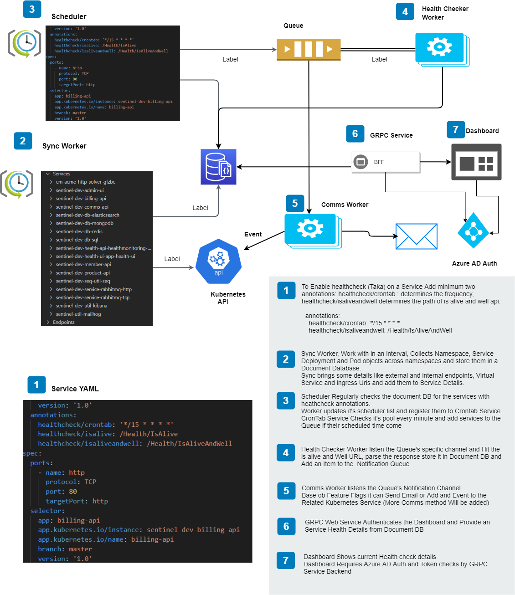

Adding grpc to Angular

https://anthonygiretti.com/2020/03/29/grpc-asp-net-core-3-1-how-to-create-a-grpc-web-client-examples-with-angular-8-and-httpclient/

https://www.cnblogs.com/ElderJames/p/call-asp_net_core-grpc-web-with-js-and-ts.html

### Because protoc doesn’t support TypeScript we need a plugin that makes protoc able to create 
### TypeScript services and client from a .proto file and this plugin is ts-protoc-gen:
### We need also to install Improbable gRPC-web library and google-protobuf package (+ its types @types/google-protobuf):

npm install --save-dev  protoc   
npm install --save-dev ts-protoc-gen   
npm install --save google-protobuf   
npm install --save-dev @types/google-protobuf   
npm install --save @improbable-eng/grpc-web   

npm install  

protoc --plugin=protoc-gen-ts="{ABSOLUTEPATH}\node_modules\.bin\protoc-gen-ts.cmd" 
       --js_out="import_style=commonjs,binary:src/app/generated" 
       --ts_out="service=grpc-web:src/app/generated" src/app/protos/{YOURPROTOFILENAME}.proto

./node_modules/protoc/protoc/bin/protoc --plugin="protoc-gen-ts=.\node_modules\.bin\protoc-gen-ts.cmd" --js_out="import_style=commonjs,binary:src/app/proto" --ts_out="service=grpc-web:src/app/proto" -I ./../Protos ../Protos/*.proto

taka
